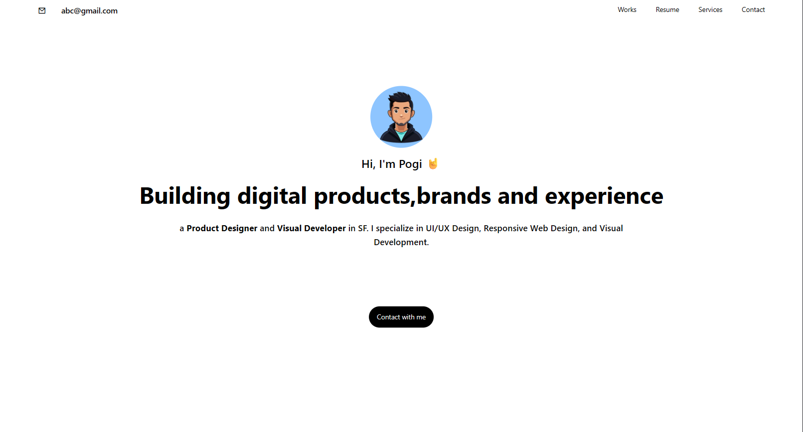

# 🌈 Tailwind Project

This is a small, foundational project built to showcase the **power and efficiency** of the utility-first workflow provided by **Tailwind CSS**.

This demo focuses on creating a **clean**, **modern**, and **highly responsive** user interface using only utility classes — demonstrating effective component building and a commitment to **maintainable front-end design**.

---

## 📱 Screenshots

### 🖼 Mobile View

### 💻 PC View

---

## 🧰 Tech Used
- **HTML5**
- **Tailwind CSS**
